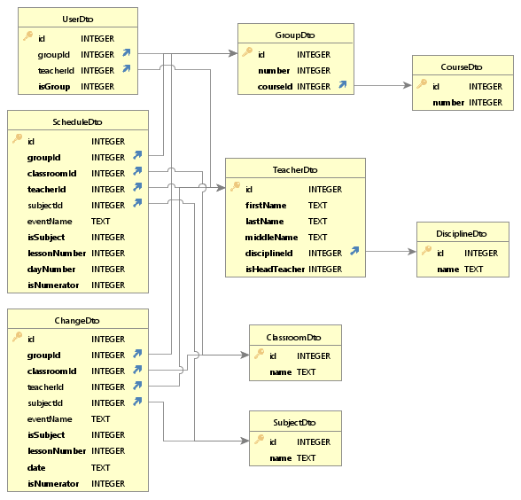

# ДОКУМЕНТАЦІЯ

- [Автентифікація](#автентифікація)
- [Зміна пароля у випадку  статусу NEW\_PASSWORD\_REQUIRED](#зміна-пароля-у-випадку--статусу-new_password_required)
- [Оновлення коду доступу](#оновлення-коду-доступу)
- [Авторизація](#авторизація)
- [Дисципліни](#дисципліни)
  - [Отримати всі дисципліни](#отримати-всі-дисципліни)
  - [Отримати дисципліну використовуючи ідентифікатор](#отримати-дисципліну-використовуючи-ідентифікатор)
  - [Додати дисципліну](#додати-дисципліну)
  - [Оновити дисципліну](#оновити-дисципліну)
  - [Видалити дисципліну](#видалити-дисципліну)
- [Класні кімнати](#класні-кімнати)
  - [Отримати всі класні кімнати](#отримати-всі-класні-кімнати)
  - [Отримати класну кімнату використовуючи ідентифікатор](#отримати-класну-кімнату-використовуючи-ідентифікатор)
  - [Додати класну кімнату](#додати-класну-кімнату)
  - [Оновити класну кімнату](#оновити-класну-кімнату)
  - [Видалити класну кімнату](#видалити-класну-кімнату)
- [Курси](#курси)
  - [Отримати всі курси](#отримати-всі-курси)
  - [Отримати курс використовуючи ідентифікатор](#отримати-курс-використовуючи-ідентифікатор)
  - [Додати курс](#додати-курс)
  - [Оновити курс](#оновити-курс)
  - [Видалити курс](#видалити-курс)
- [Предмети](#предмети)
  - [Отримати всі предмети](#отримати-всі-предмети)
  - [Отримати предмет використовуючи ідентифікатор](#отримати-предмет-використовуючи-ідентифікатор)
  - [Додати предмет](#додати-предмет)
  - [Оновити предмет](#оновити-предмет)
  - [Видалити предмет](#видалити-предмет)
- [Групи](#групи)
  - [Отримати всі групи](#отримати-всі-групи)
  - [Отримати групу використовуючи ідентифікатор](#отримати-групу-використовуючи-ідентифікатор)
  - [Додати групу](#додати-групу)
  - [Оновити групу](#оновити-групу)
  - [Видалити групу](#видалити-групу)
- [Викладачі](#викладачі)
  - [Отримати всіх викладачів](#отримати-всіх-викладачів)
  - [Отримати викладача використовуючи ідентифікатор](#отримати-викладача-використовуючи-ідентифікатор)
  - [Додати викладача](#додати-викладача)
  - [Оновити викладача](#оновити-викладача)
  - [Видалити викладача](#видалити-викладача)
- [Розклад](#розклад)
  - [Отримати розклад](#отримати-розклад)
  - [Отримати запис розкладу використовуючи ідентифікатор](#отримати-запис-розкладу-використовуючи-ідентифікатор)
  - [Додати запис розкладу](#додати-запис-розкладу)
  - [Оновити запис розкладу](#оновити-запис-розкладу)
  - [Видалити запис розкладу](#видалити-запис-розкладу)
- [Зміни](#зміни)
  - [Отримати зміни](#отримати-зміни)
  - [Отримати зміну використовуючи ідентифікатор](#отримати-зміну-використовуючи-ідентифікатор)
  - [Додати зміну](#додати-зміну)
  - [Оновити зміну](#оновити-зміну)
  - [Видалити зміну](#видалити-зміну)
- [Користувачі](#користувачі)
  - [Отримати користувачів](#отримати-користувачів)
  - [Отримати користувача використовуючи ідентифікатор](#отримати-користувача-використовуючи-ідентифікатор)
  - [Додати користувача](#додати-користувача)
  - [Оновити користувача](#оновити-користувача)
  - [Видалити користувача](#видалити-користувача)
- [Схема бази даних](#схема-бази-даних)

Базова URL: `http://ppfc.us-east-2.elasticbeanstalk.com/api`

## Автентифікація

API використовує JSON WEB Token для авторизації запитів.
Отримати токен доступу та токен для його оновлення можна за наступним маршрутом.

**Запит:**
```
POST /authenticate
```
```
{
    "username": "ІМ'Я КОРИСТУВАЧА",
    "password": "ПАРОЛЬ"
}
```

**Відповідь:**
> **200** - Запит виконано успішно.

```
{
    "status": "SUCCESS",
    "accessToken": "XXX",
    "refreshToken": "XXX"
}
```
>**200** - Запит виконано успішно, але необхідно змінити пароль користувача.
```
{
    "status": "NEW_PASSWORD_REQUIRED",
    "session": "XXX"
}
```
>**401** - Помилка авторизації, невірно введені автентифікаційні дані користувача.
```
{
    "status": "FAILURE",
    "error": "Not authorized: Incorrect username or password."
}
```

## Зміна пароля у випадку  статусу NEW_PASSWORD_REQUIRED

**Запит:**
```
POST /authChallengeSetNewPassword
```
```
{
    "username": "ІМ'Я КОРИСТУВАЧА",
    "password": "НОВИЙ ПАРОЛЬ",
    "session": "XXX"
}
```

**Відповідь:**
>**200** - Запит виконано успішно.
```
{
    "status": "SUCCESS",
    "accessToken": "XXX",
    "refreshToken": "XXX"
}
```
>**500** - Виникла внутрішня помилка, код сесії було введено не вірно.
```
{
    "status": "FAILURE",
    "error": "Internal error: Invalid session provided"
}
```

## Оновлення коду доступу

**Запит:**
```
POST /refreshAccessToken
```
```
{
    "refreshToken": "XXX"
}
```

**Відповідь:**
>**200** - Запит виконано успішно.
```
{
    "status": "SUCCESS",
    "accessToken": "XXX",
    "refreshToken": "XXX"
}
```
>**401** - Помилка авторизації, токен було введено не вірно.
```
{
    "status": "FAILURE",
    "error": "Not authorized: Invalid Refresh Token"
}
```
>**500** - Внутрішня помилка сервера.

## Авторизація

Для авторизації необхідно додати токен доступу у заголовки запита.
```
Authorization: Bearer ТОКЕН ДОСТУПУ
```


## Дисципліни

Потрібна авторизація: `ТАК`


### Отримати всі дисципліни
**Запит:**
```
GET /discipline
```

**Відповідь:**
>**200** - Запит виконано успішно.
```
[{
    "id": 1,
    "name": "ПІ"
},
...
]
```
>**401** - Помилка авторизації.

>**500** - Внутрішня помилка сервера.

### Отримати дисципліну використовуючи ідентифікатор
**Запит:**
```
GET /discipline/{id}
```

**Відповідь:**
>**200** - Запит виконано успішно.
```
{
    "id": 1,
    "name": "ПІ"
}
```
>**400** - Неправильний запит.

>**401** - Помилка авторизації.

>**500** - Внутрішня помилка сервера.

### Додати дисципліну
**Запит:**
```
POST /discipline
```
```
{
    "name": "ПІ"	
}
```
**Відповідь:**
>**200** - Запит виконано успішно.

>**400** - Неправильний запит.

>**401** - Помилка авторизації.

>**500** - Внутрішня помилка сервера.

### Оновити дисципліну
**Запит:**
```
PUT /discipline/{id}
```
```
{
    "name": "ПІ"	
}
```
**Відповідь:**
>**200** - Запит виконано успішно.

>**400** - Неправильний запит.

>**401** - Помилка авторизації.

>**500** - Внутрішня помилка сервера.

### Видалити дисципліну
**Запит:**
```
DELETE /discipline/{id}
```
**Відповідь:**
>**200** - Запит виконано успішно.

>**400** - Неправильний запит.

>**401** - Помилка авторизації.

>**500** - Внутрішня помилка сервера.


## Класні кімнати

Потрібна авторизація: `ТАК`

### Отримати всі класні кімнати
**Запит:**
```
GET /classroom
```

**Відповідь:**
>**200** - Запит виконано успішно.
```
[{
    "id": 1,
    "name": "221"
},
...
]
```
>**401** - Помилка авторизації.

>**500** - Внутрішня помилка сервера.

### Отримати класну кімнату використовуючи ідентифікатор
**Запит:**
```
GET /classroom/{id}
```

**Відповідь:**
>**200** - Запит виконано успішно.
```
{
    "id": 1,
    "name": "221"
}
```
>**400** - Неправильний запит.

>**401** - Помилка авторизації.

>**500** - Внутрішня помилка сервера.

### Додати класну кімнату
**Запит:**
```
POST /classroom
```
```
{
    "name": "221"	
}
```
**Відповідь:**
>**200** - Запит виконано успішно.

>**400** - Неправильний запит.

>**401** - Помилка авторизації.

>**500** - Внутрішня помилка сервера.

### Оновити класну кімнату
**Запит:**
```
PUT /classroom/{id}
```
```
{
    "name": "221"	
}
```
**Відповідь:**
>**200** - Запит виконано успішно.

>**400** - Неправильний запит.

>**401** - Помилка авторизації.

>**500** - Внутрішня помилка сервера.

### Видалити класну кімнату
**Запит:**
```
DELETE /classroom/{id}
```
**Відповідь:**
>**200** - Запит виконано успішно.

>**400** - Неправильний запит.

>**401** - Помилка авторизації.

>**500** - Внутрішня помилка сервера.


## Курси

Потрібна авторизація: `ТАК`

### Отримати всі курси
**Запит:**
```
GET /course
```

**Відповідь:**
>**200** - Запит виконано успішно.
```
[{
    "id": 1,
    "number": 1
},
...
]
```
>**401** - Помилка авторизації.

>**500** - Внутрішня помилка сервера.

### Отримати курс використовуючи ідентифікатор
**Запит:**
```
GET /course/{id}
```

**Відповідь:**
>**200** - Запит виконано успішно.
```
{
    "id": 1,
    "number": 1
}
```
>**400** - Неправильний запит.

>**401** - Помилка авторизації.

>**500** - Внутрішня помилка сервера.

### Додати курс
**Запит:**
```
POST /course
```
```
{
    "number": 1
}
```
**Відповідь:**
>**200** - Запит виконано успішно.

>**400** - Неправильний запит.

>**401** - Помилка авторизації.

>**500** - Внутрішня помилка сервера.

### Оновити курс
**Запит:**
```
PUT /course/{id}
```
```
{
    "number": 1
}
```
**Відповідь:**
>**200** - Запит виконано успішно.

>**400** - Неправильний запит.

>**401** - Помилка авторизації.

>**500** - Внутрішня помилка сервера.

### Видалити курс
**Запит:**
```
DELETE /course/{id}
```
**Відповідь:**
>**200** - Запит виконано успішно.

>**400** - Неправильний запит.

>**401** - Помилка авторизації.

>**500** - Внутрішня помилка сервера.


## Предмети

Потрібна авторизація: `ТАК`

### Отримати всі предмети
**Запит:**
```
GET /subject
```

**Відповідь:**
>**200** - Запит виконано успішно.
```
[{
    "id": 1,
    "name": "Основи програмної інженерії"
},
...
]
```
>**401** - Помилка авторизації.

>**500** - Внутрішня помилка сервера.

### Отримати предмет використовуючи ідентифікатор
**Запит:**
```
GET /subject/{id}
```

**Відповідь:**
>**200** - Запит виконано успішно.
```
{
    "id": 1,
    "name": "Основи програмної інженерії"
}
```
>**400** - Неправильний запит.

>**401** - Помилка авторизації.

>**500** - Внутрішня помилка сервера.

### Додати предмет
**Запит:**
```
POST /subject
```
```
{
    "name": "Основи програмної інженерії"
}
```
**Відповідь:**
>**200** - Запит виконано успішно.

>**400** - Неправильний запит.

>**401** - Помилка авторизації.

>**500** - Внутрішня помилка сервера.

### Оновити предмет
**Запит:**
```
PUT /subject/{id}
```
```
{
    "name": "Основи програмної інженерії"
}
```
**Відповідь:**
>**200** - Запит виконано успішно.

>**400** - Неправильний запит.

>**401** - Помилка авторизації.

>**500** - Внутрішня помилка сервера.

### Видалити предмет
**Запит:**
```
DELETE /subject/{id}
```
**Відповідь:**
>**200** - Запит виконано успішно.

>**400** - Неправильний запит.

>**401** - Помилка авторизації.

>**500** - Внутрішня помилка сервера.


## Групи

Потрібна авторизація: `ТАК`

### Отримати всі групи
**Запит:**
```
GET /group
```

**Параметри запиту:**

 - **courseId** - приймає ідентифікатор курсу.
 - **courseNumber** - приймає номер курсу.

**Відповідь:**
>**200** - Запит виконано успішно.
```
[{
    "id": 1,
    "number": 14,
    "course": {
        "id": 1,
        "number": 1
    }
},
...
]
```
>**400** - Неправильний запит.

>**401** - Помилка авторизації.

>**500** - Внутрішня помилка сервера.

### Отримати групу використовуючи ідентифікатор
**Запит:**
```
GET /group/{id}
```

**Відповідь:**
>**200** - Запит виконано успішно.
```
{
    "id": 4,
    "number": 44,
    "course": {
        "id": 4,
        "number": 4
    }
}
```
>**400** - Неправильний запит.

>**401** - Помилка авторизації.

>**500** - Внутрішня помилка сервера.

### Додати групу
**Запит:**
```
POST /group
```
```
{
    "number": 44,
    "courseId": 4
}
```
**Відповідь:**
>**200** - Запит виконано успішно.

>**400** - Неправильний запит.

>**401** - Помилка авторизації.

>**500** - Внутрішня помилка сервера.

### Оновити групу
**Запит:**
```
PUT /group/{id}
```
```
{
    "number": 44,
    "courseId": 4
}
```
**Відповідь:**
>**200** - Запит виконано успішно.

>**400** - Неправильний запит.

>**401** - Помилка авторизації.

>**500** - Внутрішня помилка сервера.

### Видалити групу
**Запит:**
```
DELETE /group/{id}
```
**Відповідь:**
>**200** - Запит виконано успішно.

>**401** - Помилка авторизації.

>**500** - Внутрішня помилка сервера.


## Викладачі

Потрібна авторизація: `ТАК`

### Отримати всіх викладачів
**Запит:**
```
GET /teacher
```

**Параметри запиту:**

 - **disciplineId** - приймає ідентифікатор дисципліни.
 - **disciplineName** - приймає назву дисципліни.

**Відповідь:**
>**200** - Запит виконано успішно.
```
[{
    "id": 1,
    "firstName": "Олександр",
    "lastName": "Бабич",
    "middleName": "Вікторович",
    "discipline": {
        "id": 1,
        "name": "ПІ"
    },
    "isHeadTeacher": true
},
...
]
```
>**401** - Помилка авторизації.

>**500** - Внутрішня помилка сервера.

### Отримати викладача використовуючи ідентифікатор
**Запит:**
```
GET /teacher/{id}
```

**Відповідь:**
>**200** - Запит виконано успішно.
```
{
    "id": 1,
    "firstName": "Олександр",
    "lastName": "Бабич",
    "middleName": "Вікторович",
    "discipline": {
        "id": 1,
        "name": "ПІ"
    },
    "isHeadTeacher": true
}
```
>**400** - Неправильний запит.

>**401** - Помилка авторизації.

>**500** - Внутрішня помилка сервера.

### Додати викладача
**Запит:**
```
POST /teacher
```
```
{
    "firstName": "Олександр",
    "middleName": "Вікторович",
    "lastName": "Бабич",
    "disciplineId": 1,
    "isHeadTeacher": true
}
```
**Відповідь:**
>**200** - Запит виконано успішно.

>**400** - Неправильний запит.

>**401** - Помилка авторизації.

>**500** - Внутрішня помилка сервера.

### Оновити викладача
**Запит:**
```
PUT /teacher/{id}
```
```
{
    "firstName": "Олександр",
    "middleName": "Вікторович",
    "lastName": "Бабич",
    "disciplineId": 1,
    "isHeadTeacher": true
}
```
**Відповідь:**
>**200** - Запит виконано успішно.

>**400** - Неправильний запит.

>**401** - Помилка авторизації.

>**500** - Внутрішня помилка сервера.

### Видалити викладача
**Запит:**
```
DELETE /teacher/{id}
```
**Відповідь:**
>**200** - Запит виконано успішно.

>**401** - Помилка авторизації.

>**500** - Внутрішня помилка сервера.


## Розклад

Потрібна авторизація: `ТАК`

### Отримати розклад
**Запит:**
```
GET /schedule
```

**Параметри запиту:**

 - **dayNumber** - приймає номер дня тижня.
 - **isNumerator** - приймає булеве значення, `true` - чисельник, `false` - знаменник.
 - **groupId** - приймає ідентифікатор групи.
 - **groupNumber** - приймає номер групи.
 - **teacherId** - приймає ідентифікатор викладача.

**Відповідь:**
>**200** - Запит виконано успішно.
```
[{
    "id": 1,
    "group": {
        "id": 3,
        "number": 34,
        "course": {
            "id": 3,
            "number": 3
        }
    },
    "classroom": {
        "id": 1,
        "name": "221"
    },
    "teacher": {
        "id": 1,
        "firstName": "Олександр",
        "lastName": "Бабич",
        "middleName": "Вікторович",
        "discipline": {
            "id": 1,
            "name": "ПІ"
        },
        "isHeadTeacher": true
    },
    "subject": {
        "id": 1,
        "name": "Основи програмної інженерії"
    },
    "isSubject": true,
    "lessonNumber": 1,
    "dayNumber": 1,
    "isNumerator": true
},
...
]
```
>**401** - Помилка авторизації.

>**500** - Внутрішня помилка сервера.

### Отримати запис розкладу використовуючи ідентифікатор
**Запит:**
```
GET /schedule/{id}
```

**Відповідь:**
>**200** - Запит виконано успішно.
```
{
    "id": 2,
    "group": {
        "id": 4,
        "number": 44,
        "course": {
            "id": 4,
            "number": 4
        }
    },
    "classroom": {
        "id": 1,
        "name": "221"
    },
    "teacher": {
        "id": 1,
        "firstName": "Олександр",
        "lastName": "Бабич",
        "middleName": "Вікторович",
        "discipline": {
            "id": 1,
            "name": "ПІ"
        },
        "isHeadTeacher": true
    },
    "eventName": "Консультація",
    "isSubject": false,
    "lessonNumber": 1,
    "dayNumber": 1,
    "isNumerator": false
}
```
>**400** - Неправильний запит.

>**401** - Помилка авторизації.

>**500** - Внутрішня помилка сервера.

### Додати запис розкладу
**Запит:**
```
POST /schedule
```
```
{
    "groupId": 3,
    "classroomId": 1,
    "teacherId": 1,
    "subjectId": 1,
    "lessonNumber": 1,
    "dayNumber": 1,
    "isNumerator": true
}
```
або
```
{
    "groupId": 4,
    "classroomId": 1,
    "teacherId": 1,
    "eventName": "Консультація",
    "lessonNumber": 1,
    "dayNumber": 1,
    "isNumerator": false
}
```
Ремарка: поля `subjectId` та `eventName` не є обов'язковими. У тілі запиту має бути лише одне з цих полів.

**Відповідь:**
>**200** - Запит виконано успішно.

>**400** - Неправильний запит.

>**401** - Помилка авторизації.

>**500** - Внутрішня помилка сервера.

### Оновити запис розкладу
**Запит:**
```
PUT /schedule/{id}
```
```
{
    "groupId": 3,
    "classroomId": 1,
    "teacherId": 1,
    "subjectId": 1,
    "lessonNumber": 1,
    "dayNumber": 1,
    "isNumerator": true
}
```
або
```
{
    "groupId": 4,
    "classroomId": 1,
    "teacherId": 1,
    "eventName": "Консультація",
    "lessonNumber": 1,
    "dayNumber": 1,
    "isNumerator": false
}
```
Ремарка: поля `subjectId` та `eventName` не є обов'язковими. У тілі запиту має бути лише одне з цих полів.

**Відповідь:**
>**200** - Запит виконано успішно.

>**400** - Неправильний запит.

>**401** - Помилка авторизації.

>**500** - Внутрішня помилка сервера.

### Видалити запис розкладу
**Запит:**
```
DELETE /schedule/{id}
```
**Відповідь:**
>**200** - Запит виконано успішно.

>**400** - Неправильний запит.

>**401** - Помилка авторизації.

>**500** - Внутрішня помилка сервера.


## Зміни

Потрібна авторизація: `ТАК`

### Отримати зміни
**Запит:**
```
GET /change
```

**Параметри запиту:**

 - **date** - приймає значення дати у форматі `yyyy-mm-dd`.
 - **isNumerator** - приймає булеве значення, `true` - чисельник, `false` - знаменник.
 - **groupId** - приймає ідентифікатор групи.
 - **groupNumber** - приймає номер групи.
 - **teacherId** - приймає ідентифікатор викладача.

**Відповідь:**
>**200** - Запит виконано успішно.
```
[{
    "id": 1,
    "group": {
        "id": 3,
        "number": 34,
        "course": {
            "id": 3,
            "number": 3
        }
    },
    "classroom": {
        "id": 1,
        "name": "221"
    },
    "teacher": {
        "id": 1,
        "firstName": "Олександр",
        "lastName": "Бабич",
        "middleName": "Вікторович",
        "discipline": {
            "id": 1,
            "name": "ПІ"
        },
        "isHeadTeacher": true
    },
    "subject": {
        "id": 1,
        "name": "Основи програмної інженерії"
    },
    "isSubject": true,
    "lessonNumber": 1,
    "date": "2023-03-01",
    "isNumerator": false
},
...
]
```
>**401** - Помилка авторизації.

>**500** - Внутрішня помилка сервера.

### Отримати зміну використовуючи ідентифікатор
**Запит:**
```
GET /change/{id}
```

**Відповідь:**
>**200** - Запит виконано успішно.
```
{
    "id": 2,
    "group": {
        "id": 4,
        "number": 44,
        "course": {
            "id": 4,
            "number": 4
        }
    },
    "classroom": {
        "id": 1,
        "name": "221"
    },
    "teacher": {
        "id": 1,
        "firstName": "Олександр",
        "lastName": "Бабич",
        "middleName": "Вікторович",
        "discipline": {
            "id": 1,
            "name": "ПІ"
        },
        "isHeadTeacher": true
    },
    "eventName": "Консультація",
    "isSubject": false,
    "lessonNumber": 2,
    "date": "2023-03-01",
    "isNumerator": false
}
```
>**400** - Неправильний запит.

>**401** - Помилка авторизації.

>**500** - Внутрішня помилка сервера.

### Додати зміну
**Запит:**
```
POST /change
```
```
{
    "groupId": 3,
    "classroomId": 1,
    "teacherId": 1,
    "subjectId": 1,
    "lessonNumber": 1,
    "date": "2023-03-01",
    "isNumerator": false
}
```
або
```
{
    "groupId": 4,
    "classroomId": 1,
    "teacherId": 1,
    "eventName": "Консультація",
    "lessonNumber": 2,
    "date": "2023-03-01",
    "isNumerator": false
}
```
Ремарка: поля `subjectId` та `eventName` не є обов'язковими. У тілі запиту має бути лише одне з цих полів.

**Відповідь:**
>**200** - Запит виконано успішно.

>**400** - Неправильний запит.

>**401** - Помилка авторизації.

>**500** - Внутрішня помилка сервера.

### Оновити зміну
**Запит:**
```
PUT /change/{id}
```
```
{
    "groupId": 3,
    "classroomId": 1,
    "teacherId": 1,
    "subjectId": 1,
    "lessonNumber": 1,
    "date": "2023-03-01",
    "isNumerator": false
}
```
або
```
{
    "groupId": 4,
    "classroomId": 1,
    "teacherId": 1,
    "eventName": "Консультація",
    "lessonNumber": 2,
    "date": "2023-03-01",
    "isNumerator": false
}
```
Ремарка: поля `subjectId` та `eventName` не є обов'язковими. У тілі запиту має бути лише одне з цих полів.

**Відповідь:**
>**200** - Запит виконано успішно.

>**401** - Помилка авторизації.

>**500** - Внутрішня помилка сервера.

### Видалити зміну
**Запит:**
```
DELETE /change/{id}
```
**Відповідь:**
>**200** - Запит виконано успішно.

>**400** - Неправильний запит.

>**401** - Помилка авторизації.

>**500** - Внутрішня помилка сервера.


## Користувачі

Потрібна авторизація: `ТАК`

### Отримати користувачів
**Запит:**
```
GET /user
```

**Параметри запиту:**

 - **isStudent** - приймає булеве значення, `true` - студенти, `false` - викладачі.

**Відповідь:**
>**200** - Запит виконано успішно.
```
[{
    "id": 123456789,
    "group": {
        "id": 1,
        "number": 14,
        "course": {
            "id": 1,
            "number": 1
        }
    },
    "isGroup": true
},
...
]
```
>**401** - Помилка авторизації.

>**500** - Внутрішня помилка сервера.

### Отримати користувача використовуючи ідентифікатор
**Запит:**
```
GET /user/{id}
```

**Відповідь:**
>**200** - Запит виконано успішно.
```
{
    "id": 123456789,
    "group": {
        "id": 1,
        "number": 14,
        "course": {
            "id": 1,
            "number": 1
        }
    },
    "isGroup": true
}
```
>**400** - Неправильний запит.

>**401** - Помилка авторизації.

>**500** - Внутрішня помилка сервера.

### Додати користувача
**Запит:**
```
POST /user
```
```
{
    "id": 123456790,
    "groupId": 1
}
```
або
```
{
    "id": 987654321,
    "teacherId": 1
}
```
Ремарка: поля `groupId` та `teacherId` не є обов'язковими. У тілі запиту має бути лише одне з цих полів.

**Відповідь:**
>**200** - Запит виконано успішно.

>**400** - Неправильний запит.

>**401** - Помилка авторизації.

>**500** - Внутрішня помилка сервера.

### Оновити користувача
**Запит:**
```
PUT /user
```
```
{
    "id": 123456790,
    "groupId": 1
}
```
або
```
{
    "id": 987654321,
    "teacherId": 1
}
```
Ремарка: поля `groupId` та `teacherId` не є обов'язковими. У тілі запиту має бути лише одне з цих полів.

**Відповідь:**
>**200** - Запит виконано успішно.

>**400** - Неправильний запит.

>**401** - Помилка авторизації.

>**500** - Внутрішня помилка сервера.

### Видалити користувача
**Запит:**
```
DELETE /user/{id}
```
**Відповідь:**
>**200** - Запит виконано успішно.

>**400** - Неправильний запит.

>**401** - Помилка авторизації.

>**500** - Внутрішня помилка сервера.


## Схема бази даних

